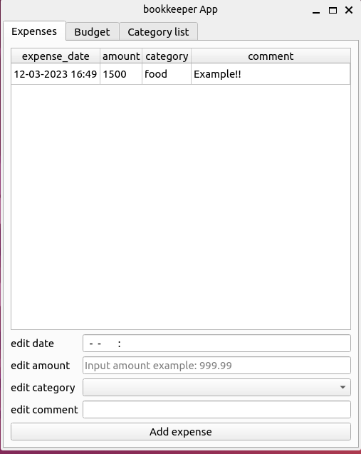
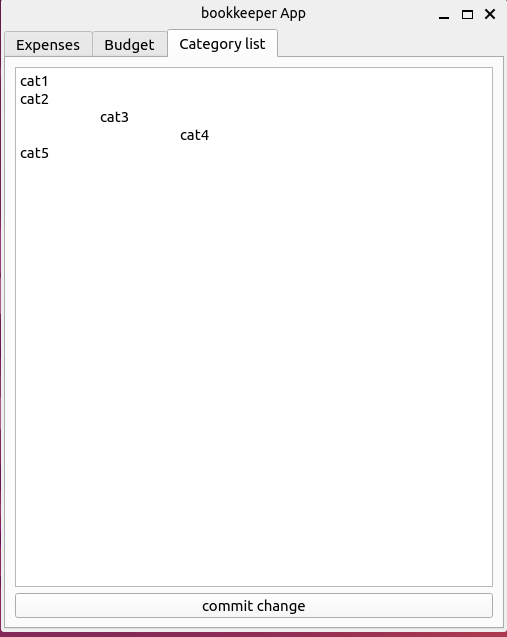

# Простая программа для управления личными финансами
#### (учебный проект для курса по практике программирования на Python)

# Программа позволяет:
  1. Записывать, удалять, редактировать расходы.
  2. Устанавливать бюджет на текущий день, неделю и месяц, а также слдеить за его выполнением.
  3. Смотреть расходы по категориям за день и текущий месяц

# Как пользоваться

1. Для старта программы скачать к себе в папку. Затем запустить файл main_file.py
Откроется вот такое окно(Интерфейс Ubuntu 22.0):

2. Список категорий заполняется во вкладке "Category list"
  * Записываем категории в каждой строке, затем нажимаем кнопку "commit change".
  * При записи проверяется, что в списке нет категорий с одиноковым названием.(Незначащие пробелы и табы не учитываются). Если будут, вылезет меню с ошибкой.
  * Также можно выделять подкатегории пробелом или табом. Практически это не используется, но информация о подкатегориях записывается в репозиторий. В следующих версиях программы добалю аналитику по подкатегориям)

3. Для добаления расхода необходимо заполнить соответствующие поля данными в нужнов формате и нажать кнопку "Add expense".
  Формат полей:
  edit date -> день - месяц - год час:минута
  edit amount -> Число >=0
  edit category -> Выбрать из выпадающего список из категорий (список категорий записывается в листе "Category list")
  edit comment -> строка. Требований нет пользователь сам знаем решает. Если запишет что-то невнятно сможет поправить
  
  
